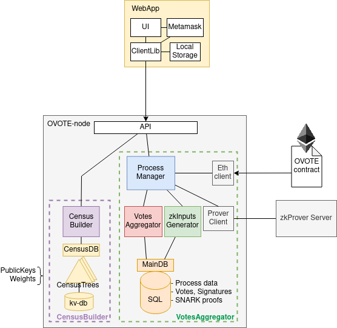

# ovote-node [](https://godoc.org/github.com/aragon/ovote-node) [](https://goreportcard.com/report/github.com/aragon/ovote-node) [](https://github.com/aragon/ovote-node/actions?query=workflow%3ATest)

*Research project.*

OVOTE: Offchain Voting with Onchain Trustless Execution.

This repo contains the OVOTE node implementation, compatible with the [ovote](https://github.com/aragon/ovote) circuits & contracts. All code is in early stages.

More details on the ovote-node behaviour can be found at the [OVOTE document](https://github.com/aragon/research/blob/main/ovote/ovote-draft.pdf).



## Usage
In the `cmd/ovote-node` build the binarh: `go build`

Which then can be used:
```
> ./ovote-node --help
Usage of ovote-node:
  -d, --dir string        storage data directory (default "~/.ovote-node")
  -l, --logLevel string   log level (info, debug, warn, error) (default "info")
  -p, --port string       network port for the HTTP API (default "8080")
  -c, --censusbuilder     CensusBuilder active
  -v, --votesaggregator   VotesAggregator active
      --eth string        web3 provider url
      --addr string       OVOTE contract address
      --block uint        Start scanning block (usually the block where the OVOTE contract was deployed)
```

So for example, running the node as a CensusBuilder and VotesAggregator for the ChainID=1 would be:
```
./ovote-node -c -v --chainid=1 \
--eth=wss://yourweb3url.com --addr=0xTheOVOTEContractAddress --block=6678912
```


## Test
- Tests: `go test ./...` (need [go](https://go.dev/) installed)
- Linters: `golangci-lint run --timeout=5m -c .golangci.yml` (need [golangci-lint](https://golangci-lint.run/) installed)

